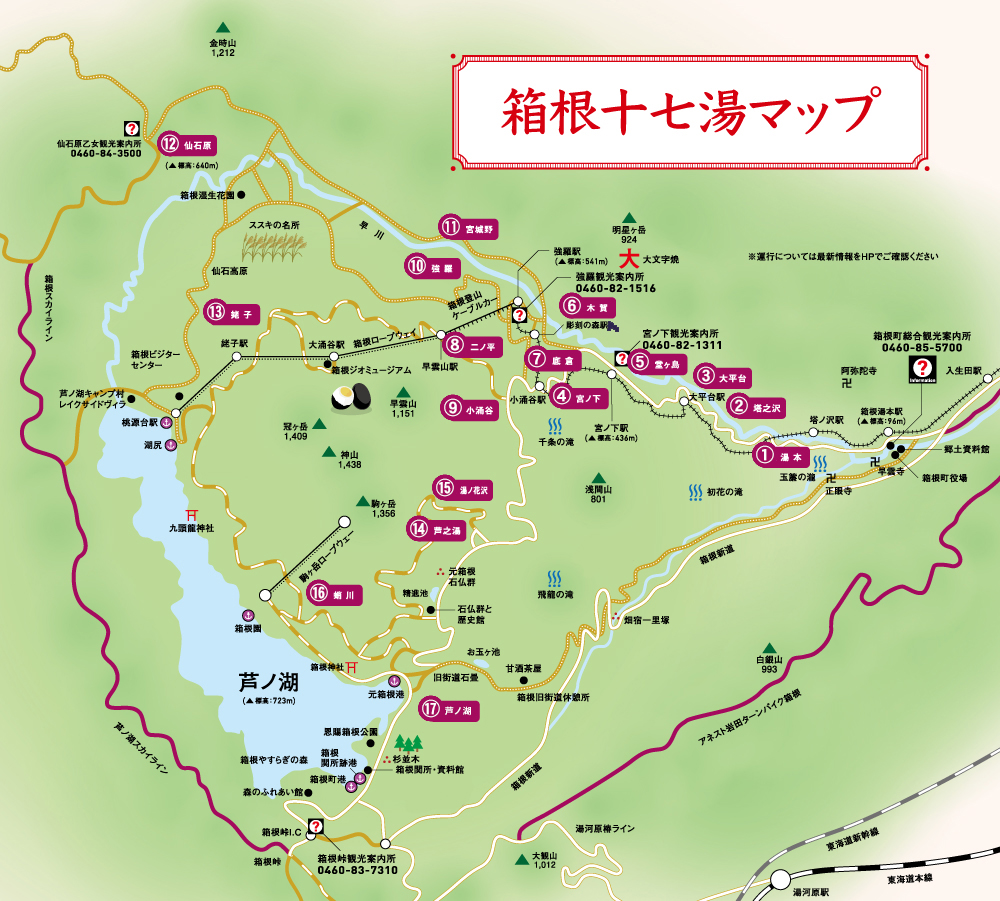

<!-- classes: title -->

# 箱根の温泉について

---
# 箱根といえば
- 有名な温泉地
- 箱根七湯、箱根十七湯などが著名
- 大涌谷、湖尻、早雲山を加えて箱根二十湯と呼ぶ人たちもいる

観光協会公式が十七って言っているから十七で良いと思う

---
# 十七湯一覧
- 湯本、塔之沢、大平台、宮ノ下
- 堂ヶ島(欠番)、木賀、底倉、ニノ平、小涌谷
- 強羅、宮城野、仙石原、姥子
- 芦ノ湯、湯の花沢、蛸川、芦ノ湖

---
# マップ

---
# ぶっちゃけ
- 多い。十七種類も温泉があるわけではない
- どうせ皆、同じような成分だろう？

---
# 結構違う

---
# 大まかに分けると
1. 単純温泉(or アルカリ単純温泉)
2. 塩化物泉
3. 硫酸塩泉
4. 硫黄泉

雑に入っても明確に分かるくらいの差がある

---
# 1. 単純温泉(or アルカリ単純温泉)
- 観光協会公式では下層には塩化物重炭酸塩硫酸塩泉（混合型）とある
- 実際のところ単純温泉の方が多い印象
- 下流のエリアは大体これ

---
# 1. 単純温泉(or アルカリ単純温泉)
- 湯本までのアクセスが抜群に良い
  - 小田原まで新幹線、小田急ロマンスカー、箱根口IC etc.
- 商店街や良い旅館も揃っている
- 日帰りまで検討できる。何かのついでに寄るならオススメ

---
# 単純温泉 is 何？
- 温泉法による以下の規定を満たしたもの
  - 温泉水1kg中に溶存している気体以外の物質の含有量が1g未満
  - 25℃以上で湧出する温泉
- pH8.5未満が単純温泉、pH8.5以上がアルカリ単純温泉

---
# 2. 塩化物泉
- 強羅駅周辺に固まっている印象
- 塩素の匂いが強くて初回は温泉かどうかを疑いたくなる
- 急斜面で土地が狭いからか露天が少なめの印象がある

---
# 2. 塩化物泉
- 強羅駅は世界第二位の勾配を誇る箱根登山電車の終着駅
  - 強羅から先はケーブルカーやロープウェイ
- 途中3回のスイッチバックや摩耗防止の散水など鉄オタの人は楽しいかも
- 彫刻の森や大文字焼で有名な明星ヶ岳が近く観光地としてもそこそこ

---
# 3. 硫酸塩泉
- 一つにまとめてしまったが酸性、重炭酸塩、塩化物重炭酸塩などバラエティ豊か
- 成分次第で色が変化したり薄ら臭いがあったりする面白い温泉
- 場所によっては(一応)富士山を見ながら温泉に入れる場所もある

---
- 車を持っていない限りバスで向かうことしかできなくアクセスは悪い
- 中腹より上のあたりに多く分布が硫黄泉と割と被っている
- 金時山、大涌谷など自然の見どころが多い

---
# 4. 硫黄泉
- 硫黄の匂いが強く、入ると体が硫黄臭くなる
- 湯の花沢のように湯の花(沈殿物)がある温泉もある

---
- 3とアクセスは同じで良くない
- 3と同様に中腹より上のあたりにある
- 芦ノ湖や箱根神社などが他に観光地としてはあげられる

---
# どこまで信用して良いの？
- 結構みんな適当に温泉を引いている印象がある
- ホテルによっては2種類くらい引いているところもある(オススメ)
- 行く前に温泉の泉質を調べておくと安定

---
# reference
- https://www.hakone.or.jp/
- https://www.hakone-ryokan.or.jp/senshitsu/
- https://www.env.go.jp/nature/onsen/pdf/2-1_p_1.pdf
- https://www.ichinoyu.co.jp/yumeguri/
- https://www.hakone-ryokan.or.jp/senshitsu/
  - 向かう宿の温泉の泉質を調べたいならこのリンクが便利！